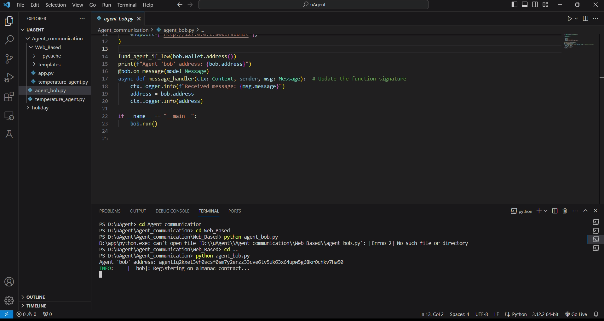
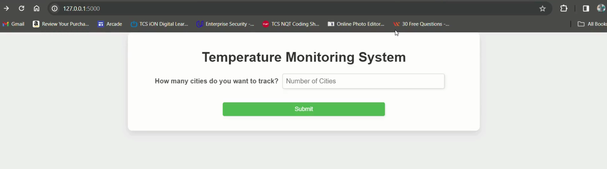
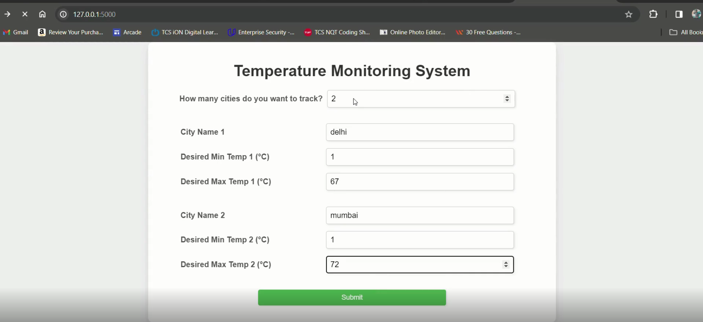

# <u>Fetch-A-THON'24</u>

# TriExploreHub 🌍✈️

## Step 1: Prerequisites 🛠️
Before embarking on your journey, make sure you have the essentials:
- Python (3.8+ is recommended) 🐍
- Poetry (a packaging and dependency management tool for Python) 📦

## Step 2: Set up .env file 🗝️
To unlock the wonders of our demo, you'll need API keys from:
- RapidAPI 🚀
- OpenAI 🧠
- SerpAPI 🌐
- Twilio 📲

### RapidAPI Key 🔑
1. Visit RapidAPI.
2. Sign up or log in.
3. Search for the Skyscanner API and subscribe.
4. Once subscribed, copy your X-RapidAPI-Key.

### OpenAI API Key 🔑
1. Visit OpenAI.
2. Sign up or log in.
3. Navigate to the API section to obtain your API key.

*Note: If you’ve run out of OpenAI credits, you will not be able to get results for this example.*

### SerpAPI Key 🔑
1. Visit SerpAPI.
2. Sign up or log in.
3. Your API key will be available on the dashboard.

### Twilio Key 🔑
1. Visit Twilio.
2. Sign up or log in.
3. Your credentials are available like:
    - Account SID: 'AC5f05e627xxx2821xxxxxxb764d9a0'
    - Auth Token: 'a79cbfc2xxxxxxxxxxx7dx0ffe61'

## Running the Bot 1: Temperature Reminder Bot 🌡️📅
To experience the warmth of our project:
```bash
python agent_bob.py
```
Look for the following output in the logs:
```
Agent 'bob' address: {agentxxxxxxxxxxxx3434}
```
Copy this address and paste it in the `temperature_agent.py` file.

Now, feel the heat:
```bash
python app.py
```
Open the generated link in a web browser.

### After Running Bot 1:





## Running Bot 2: Holiday Planning 🏖️🎉
1. Initiate the magic:
```bash
python main.py
```
2. Copy the agent IDs for `top_destination_agent` and `top_activities_agent`.
3. Paste the IDs in `top_dest_client.py` and `activity_client.py` respectively.
4. Discover your dream destinations:
```bash
python top_dest_client.py
```
Share your preferences when prompted.

## Running Bot 3: Activity Planning 🎭🔍
1. Dive into the adventure:
```bash
python activity_client.py
```
2. Share your favorite activities when prompted.

The bot will unveil exciting possibilities using SerpAPI and filter them using the LLM model.

## Final Demonstration Video 📽️ 
Watch the adventure unfold in our [demonstration video](https://drive.google.com/file/d/1fjxnweBMUnTpDDmstQrwxJVA5lk0njI-/view?usp=sharing)

### Bot Bonanza: 🤖🎉

#### Temperature Reminder Bot:
- This bot makes sure you're never left in the cold! 🥶
- Just tell it your cities and temperature preferences, and it'll send you daily updates via WhatsApp, complete with weather poems! 📱🌦️

#### Holiday Planning Bot:
- Dreaming of sandy beaches or bustling cities? 🏙️🏝️
- This bot curates the top 5 destinations tailored to your preferences and sends them straight to your WhatsApp inbox! 📲✈️

#### Activity Planning Bot:
- Get ready for an adventure-packed day! 🎭🌟
- From museums to parks, this bot suggests the best activities based on your interests, city, and date! 🗺️🎉

Set sail on your journey with TriExploreHub and let the bots guide you to unforgettable experiences! 🚀🌟
